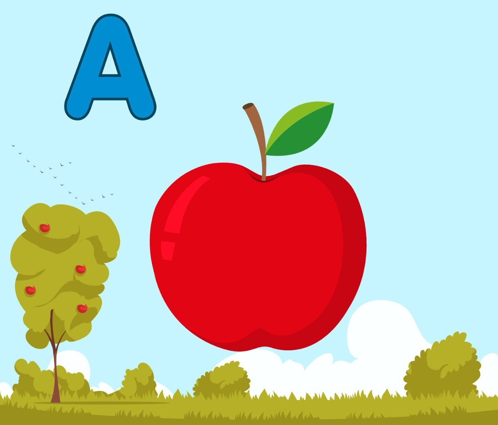
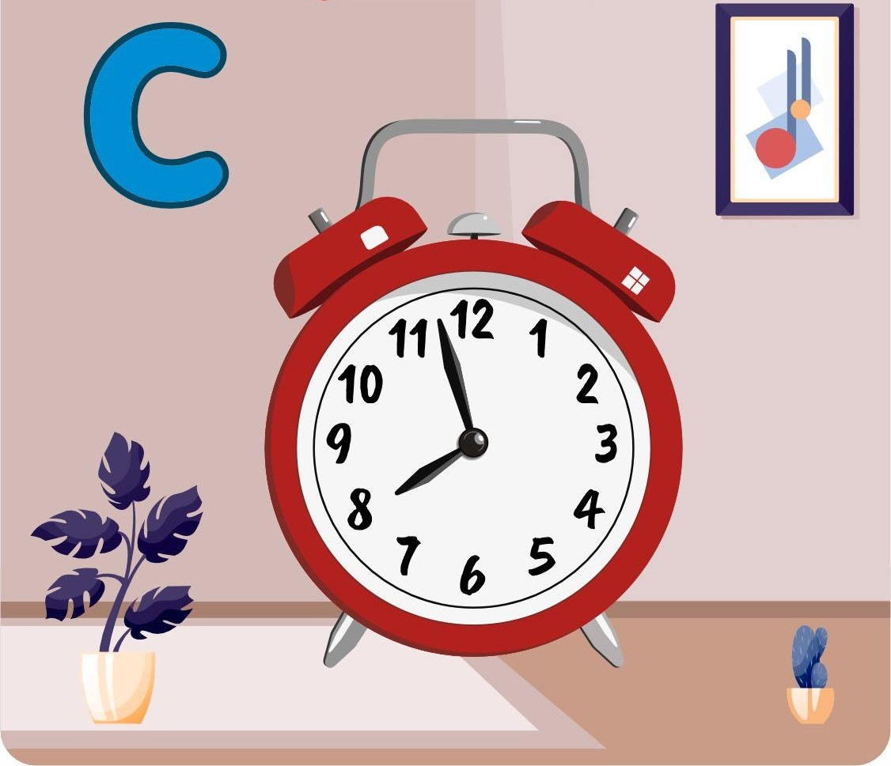

## Alphabet in Augmented Reality

Our project "Alphabet in Augmented Reality" is an innovative and interactive way for children to learn the alphabet. Using augmented reality technology, each letter of the alphabet is brought to life through an engaging and interactive experience.

## Instructions to use
-> Download the app, Scan the marker and experience 3D visualization of Alphabets. 

## 🔗 APP Link
[👉  App Link](https://drive.google.com/file/d/1oo2eth9QcBO1MJWrm1NAEdPYtJNbyRd8/view?usp=share_link)

## App marker
    

