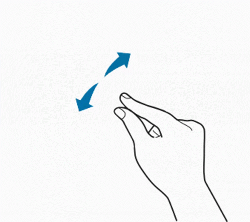

# Super Simple Unity Solar System Simulation

Our project has the potential to include a virtual reality (VR) visualization of the solar system. This feature would provide students with a unique and immersive learning experience, allowing them to explore and understand the relationships between the planets, stars, and other celestial objects in our solar system.

*Here's a gif of the simulation system:*

## 🔗 APP Link
[👉  App Link](https://drive.google.com/file/d/1-yx9VLJ5Lg4oDqOU7Ec7BLIQqUphYqhx/view?usp=share_link)

## App Instructions
1. On clicking of planet, focus of view changed to that planet, Zoom view is open.
2. when you perform below action, on any planet, it give information of that planet 

